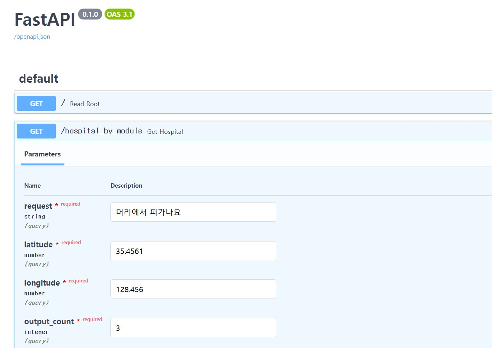

# 🚑 응급실 추천 시스템

## 개요

이 프로젝트는 사용자의 입력(음성 또는 텍스트)을 기반으로 응급실을 추천하는 FastAPI 기반의 시스템입니다. 사용자의 위치와 응급 상황의 심각도를 분석하여 적절한 응급실을 추천합니다.

#### 응급실 추천 과정:

1. 사용자의 입력(텍스트, 위도, 경도, 요청 개수)을 받음
2. 텍스트 요약 수행
3. 응급 상황의 심각도를 예측
4. 응급실 데이터베이스에서 적절한 응급실을 추천
5. 추천 결과를 데이터베이스에 저장 후 반환

## 프로젝트 구조

### 1. `main.py`

FastAPI를 이용한 백엔드 서버를 구성하는 파일로, API 엔드포인트를 제공합니다.

- **기본 엔드포인트:**
  - `/:` 기본 응답을 반환하는 API
  - `/hello`: 단순 응답 API
  - `/api/hello`: 응급실 추천을 수행하는 API

### 2. `emergency.py`

응급실 추천과 관련된 여러 기능을 모아둔 파일입니다.

- **API 키 로드:** `load_key_file`  
  OpenAI API 및 NAVER MAP API 키를 불러옵니다. (현재 보안 문제로 삭제됨)

- **음성 인식:** `audio2text`  
  OpenAI의 Whisper API를 사용해 음성을 텍스트로 변환합니다.

- **텍스트 요약:** `text_summary`  
  GPT 모델을 이용해 응급 상황을 요약합니다.

- **응급 상황 예측:** `model_prediction`, `predict`  
  BERT 모델을 활용해 응급 상황의 심각도를 예측합니다.

- **응급실 추천:** `get_dist`, `recommendation`  
  네이버 지도 API를 이용해 현재 위치에서 가까운 응급실을 검색하고 필터링합니다.

- **데이터베이스 관리:** `create_table`, `insert_data`, `find_df`  
  SQLite를 이용해 추천 로그를 저장하고 조회할 수 있도록 합니다.

### 3. `map_key.txt` (보안 문제로 삭제됨)

네이버 지도 API를 사용하기 위한 `c_id` 및 `c_key`가 저장된 파일이었으나, 보안 문제로 삭제되었습니다.

### 4. `api_key.txt` (보안 문제로 삭제됨)

OpenAI API 키가 저장된 파일이었으나, 보안 문제로 삭제되었습니다.

## 결과 화면

다음은 응급실 추천 시스템의 실행 결과 화면 예시입니다.

    
    

